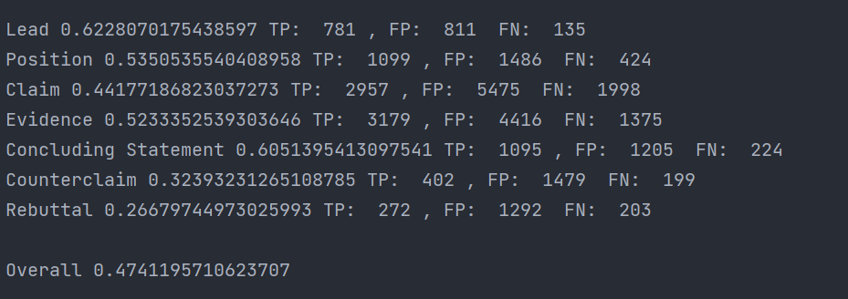
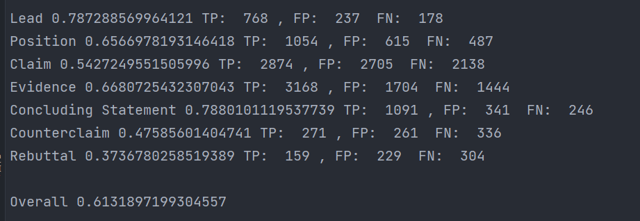
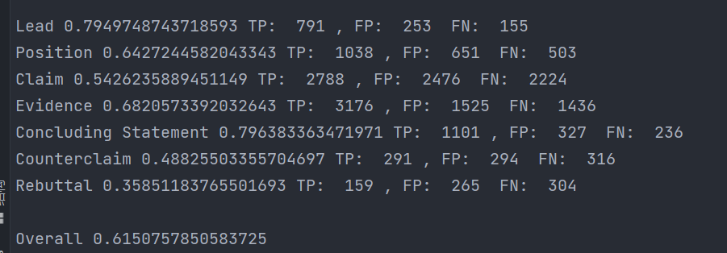
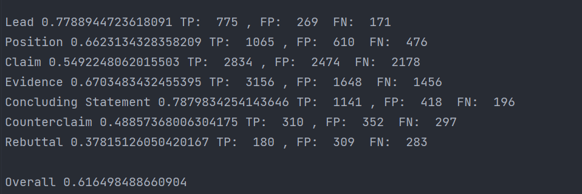
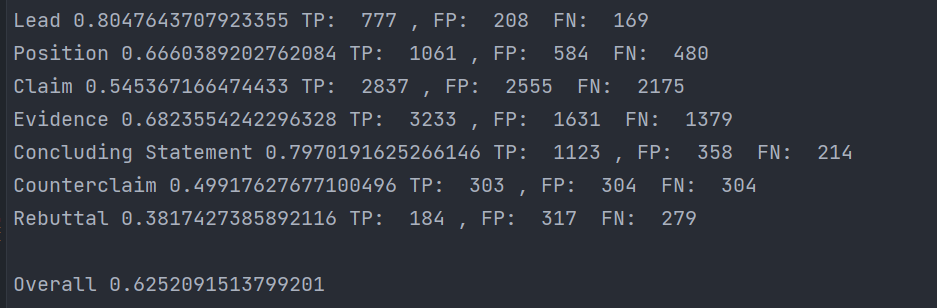

新的代码放在这里 再readme.md里记录一下评分  
bert-base: 0.48

| 啥时候做的 | 叫啥           | 咋样啊                          | 做了啥                                               |
| ------ |--------------|------------------------------|---------------------------------------------------|
| 21-12-25 | roberta-v1   | 0.532                        ||
| 22-01-7 | bigbird-copy | 0.595                        ||
| 22-01-12 | bert-v1      | 0.484                        ||
 |22-01-17 | bigbird-陈队模板 | 0.604     | 四个output连接                                        ||
|22-01-18| bigbird-v2| 0.611 | 每类对应不同阈值                                          ||
|22-01-21|bigbid-v3| 0.609 | 针对那两个逼类进行augment,train和valid没分开，且ratio过大（0.3、0.2） ||
|22-01-21|bigbird-v4|| 只对trainaugment，ratio都为0.15|
|22-01-22|bigbird-v5||在getitem里也进行augment|
|22-01-22|bigbird-v6||两个epoch|
|22-01-23|bigbird-v6-2||3个epoch|