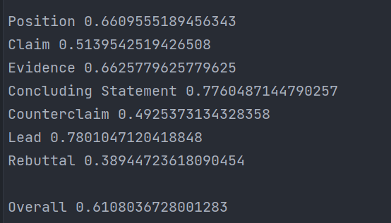
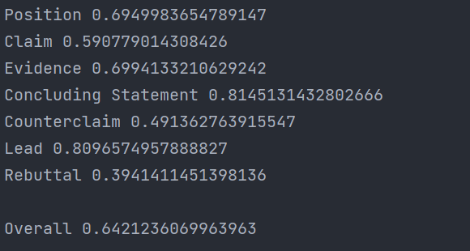

新的代码放在这里 再readme.md里记录一下评分  
bert-base: 0.48

| 啥时候做的 | 叫啥           | 咋样啊                          | 做了啥        |
| ------ |--------------|------------------------------|------------|
| 21-12-25 | roberta-v1   | 0.532                        ||
| 22-01-7 | bigbird-copy | 0.595                        ||
| 22-01-12 | bert-v1      | 0.484                        ||
 |22-01-17 | bigbird-陈队模板 | 0.604     | 四个output连接 ||
|22-01-18| bigbird-v2| 0.611 | 每类对应不同阈值   ||
