| 日期    | 标题                 | 结果展示                               | 简介                               |
|---|---|---|---|
| 21-12-25 | roberta-v1              | 0.532                                  ||
| 22-01-7  | bigbird-copy            | 0.595                                  ||
| 22-01-12 | bert-v1                 | 0.484                                  ||
| 22-01-17 | bigbird-陈队模板            | 0.604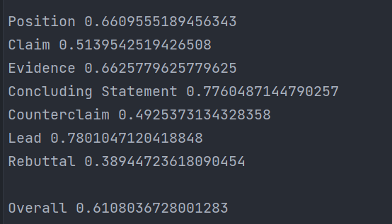               | 四个output连接                                        ||
| 22-01-18 | bigbird-v2              | 0.611           | 每类对应不同阈值                                          ||
| 22-01-21 | bigbid-v3               | 0.609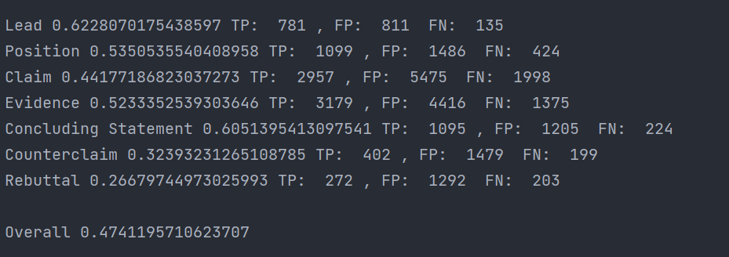           | 针对那两个逼类进行augment,train和valid没分开，且ratio过大（0.3、0.2） ||
| 22-01-21 | bigbird-v4              | 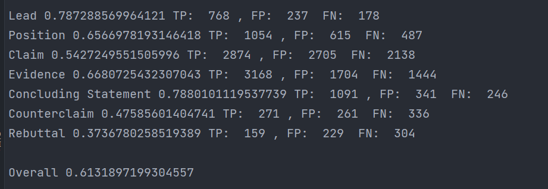                | 只对trainaugment，ratio都为0.15                        |
| 22-01-22 | bigbird-v5              | 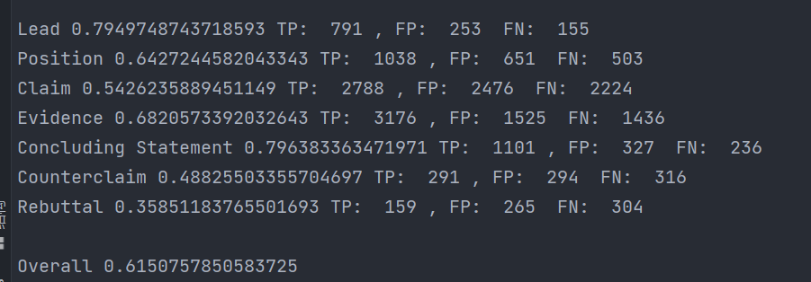                | 在getitem里也进行augment                               |
| 22-01-22 | bigbird-v6              | 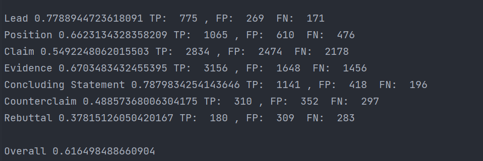                | 两个epoch                                           |
| 22-01-23 | bigbird-v6-2            | 0.633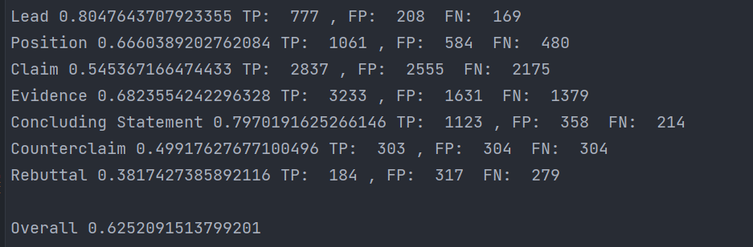           | 3个epoch                                           |
| 22-01-25 | longformer-v1           | 0.634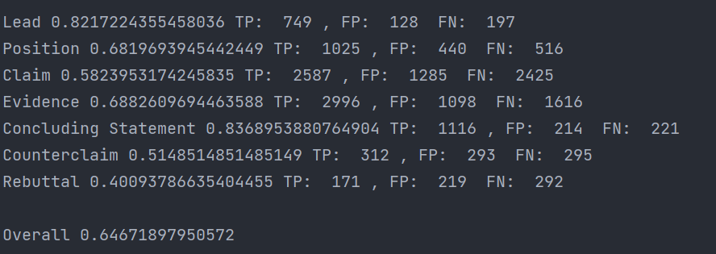           | 3个epoch，添加拼写纠正，子词重组按哪个多就算哪类                       |
| 22-01-26 | longformer-v2           | 0.628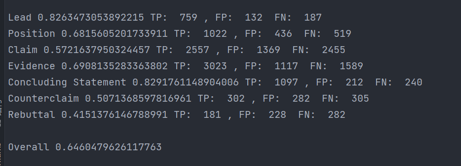         | 3个epoch，去掉了拼写纠正                                   ||
| 22-01-28 | longformer-v3           | 0.630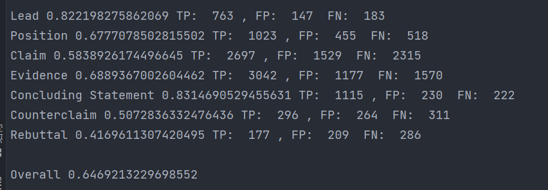           | 3个epoch，eda了3倍                                    ||
| 22-01-28 | longformer-v4           | 0.634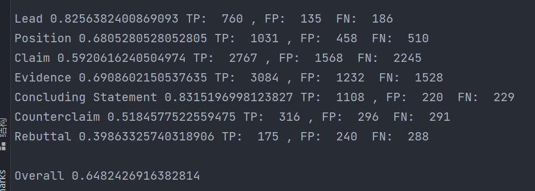           | 对claim也eda了，只eda 2倍                               ||
| 22-01-30 | longformer-v5           | 0.631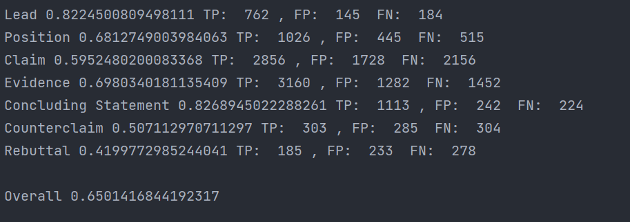         | 较v4，在训练阶段加了拼写纠正                                   ||
| 22-02-03 | longformer-v6           | 0.636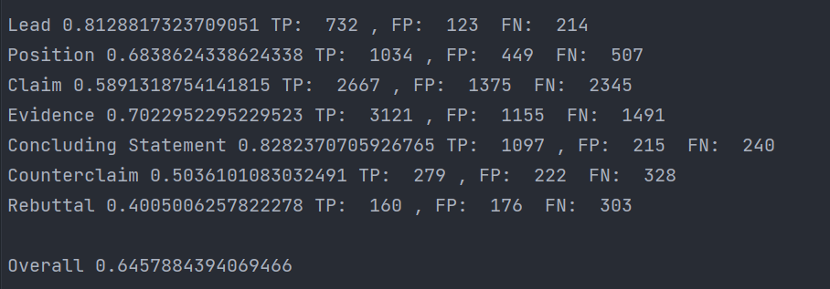         | 学习率先小后大再小，也有拼写纠正                                  ||
| 22-02-11 | longformer-bilstm-crf-v1 | 0.621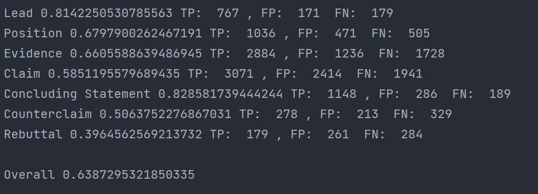         | 训练了3个epoch，没有froze longformer                     ||
| 22-02-15 |longformer-bilstm-crf-v2| 0.624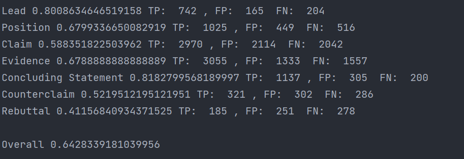         | 训练4个epoch，去掉了bilstm，loss为170左右                    ||
| 22-02-16 |longformer-bilstm-crf_v3| 0.635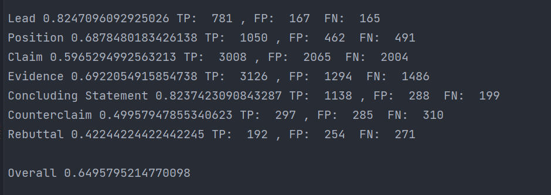         | 训练8个expoch， loss降到26                              ||
|22-02-17|longformer-v7| 0.643                                  |                                                   |
| 22-02-17 | longformer-v8           | 0.637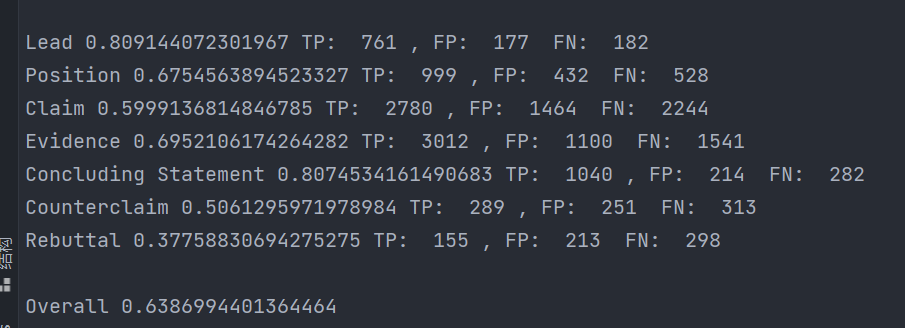         | 对其他主类做了下采样                                        ||
| 22-02-18 |fusion_1-8| 0.653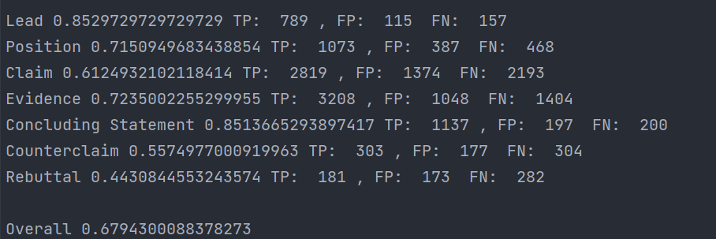         |                                                   ||
| 22-02-20 | longformer-v9           | 0.630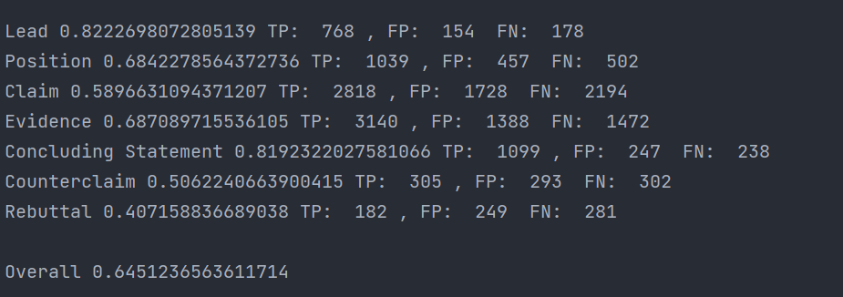         | 下采样，训练5个epoch                                     ||
| 22-02-22 | longformer-train-all-v1 | 0.634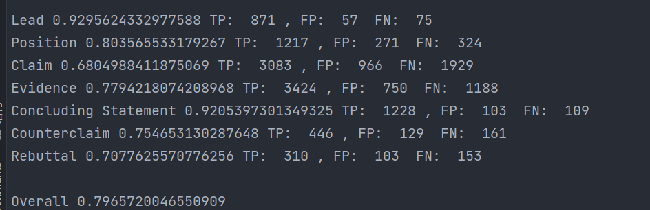         | 无下采样，5个epoch，在取数据时也eda                            ||
| 22-02-22 |longformer-train-all-v2| 0.627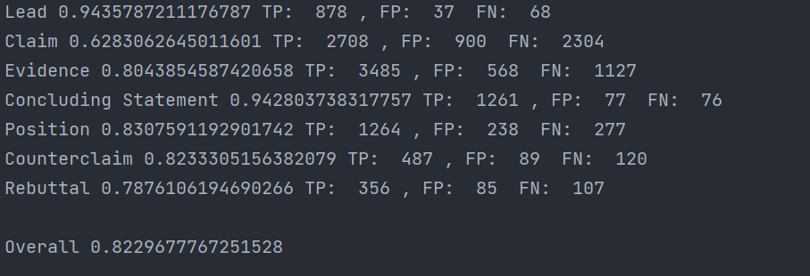         | 取数据时没有eda，eda2倍，5个epoch                           ||
| 22-02-23 |train-all-v3| 0.634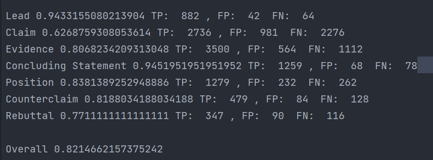         | eda 1倍，8个epoch                                    ||
| 22-02-24 |train-all-v4| 0.623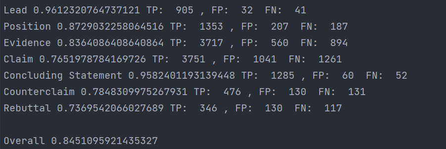         | 无eda，8个epoch                                      ||
| 22-02-25 |train-all-v5| 0.630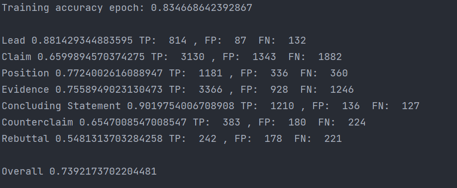         | 无eda，6个epoch，用了wramup，累加三次梯度才更新一次，但是忘记zero_grad了  ||
| 22-02-25 |train-all-v6| 0.631 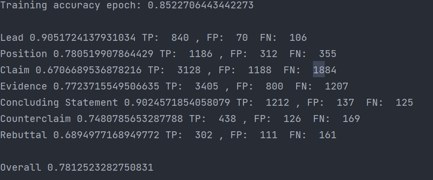        | eda 2倍，取数据时不eda                                   ||
|22-02-25|train-all-v7| 0.62 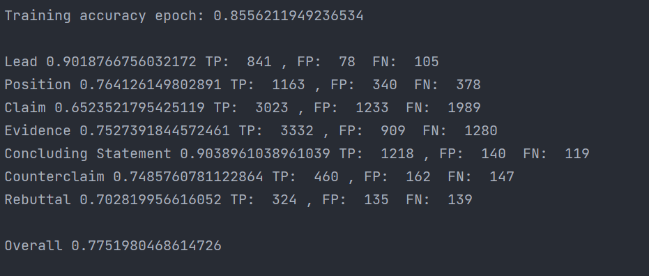         | eda2倍，对主类下采样30%                                   ||
|22-02-26|train-all-v8| 0.624  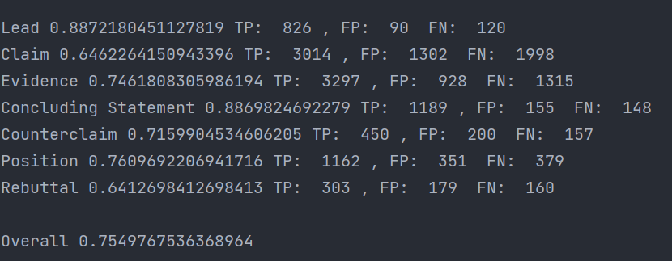       | 取数据时拼写纠正                                          |
|22-02-27|fusion 1345678| 0.652                                  ||
|22-02-28|train-all-v9| 0.628     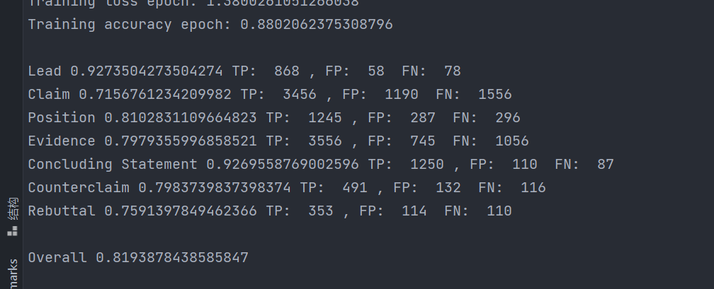    | eda 1倍，无拼写纠正，10个epoch，下采样20%                      |
|22-03-03|longformer-larger-v1| 0.651 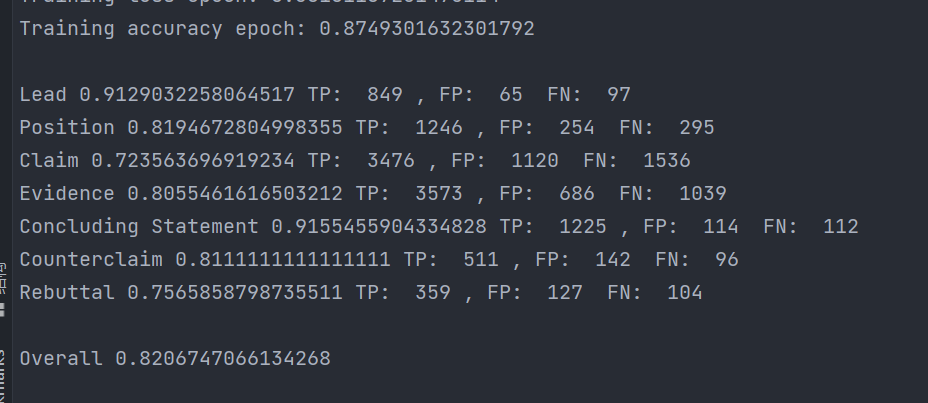        | eda1倍，五拼写纠正，5个epoch，下采样20%                        |
|22-3-4|longformer-large-v2| 0.650 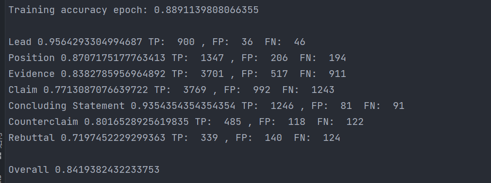        | eda2倍，对claim也eda，取数据时也eda                         ||
|22-3-6|longformer-large-v3| 0.651、0.655  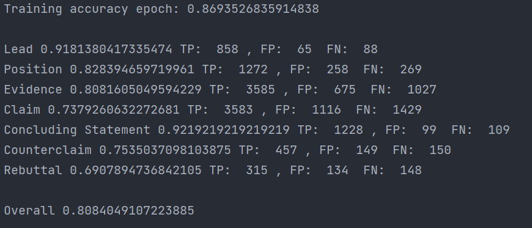 | 累加8次更新一次，无下采样，也eda2倍，取数据时不eda                     |
|22-3-8|longformer-large-v4| 0.636 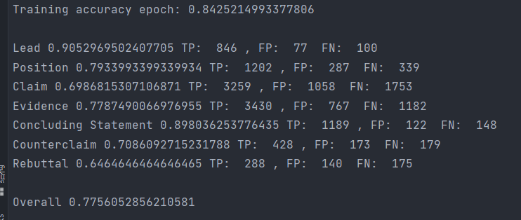        | 累加8次，eda1倍，缺数据时也eda且无seed                         ||
|22-3-8|longformer-large-v5| 0.656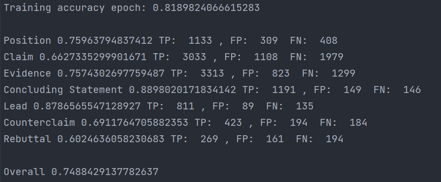         | 累加8次，eda1倍，claim不eda                              ||
|22-3-9|longformer-large-v6| 0.306 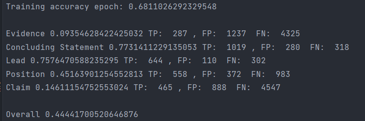        | 用了讨论区的config                                      ||
|22-3-10|longformer-large-v7|0.646 | 10个epoch， 对claim不eda   |
|22-3-12|longformer-large-v8| 0.649|10epoch,同上，提高近义词替换比例||
